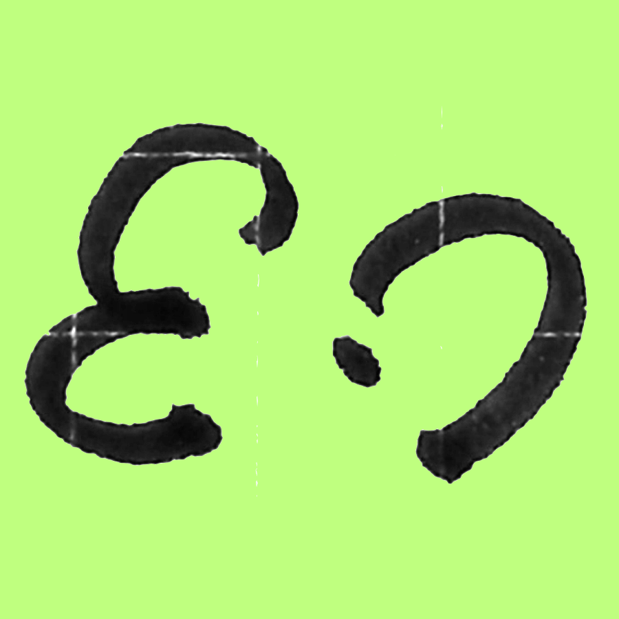

# mus-css
mus-css: A tool to develop userChromeCSS easily with marionette protocol

</img>

## Features

- Load userChrome CSS into Firefox in real-time via Marionette protocol
- Chrome-privileged context execution for direct browser UI manipulation
- Built with marionette@0.7.0 protocol definitions
- Custom Marionette client implementation based on geckodriver analysis
- Screenshot capture for browser window and specific elements using CSS selectors
- CI/CD friendly screenshot functionality for visual regression testing

## Implementation Details

This tool uses the Firefox Marionette protocol to communicate with Firefox and execute JavaScript in a **chrome-privileged context**. This allows direct access to XPCOM components like `nsIStyleSheetService` for injecting CSS into the browser UI.

### Chrome Context vs Content Context

- **Content Context**: Regular web page JavaScript execution (default)
- **Chrome Context**: Privileged browser context with access to:
  - XPCOM components (`Cc`, `Ci`)
  - Firefox Services API
  - Chrome URIs (`chrome://`)
  - nsIStyleSheetService for userChrome CSS

For more details on the chrome-privileged context implementation, see [GECKODRIVER_ANALYSIS.md](GECKODRIVER_ANALYSIS.md).

## Usage

### Registering chrome.manifest (Recommended)

The recommended approach is to register a `chrome.manifest` file instead of bundling CSS. This allows you to use `@import` statements with `chrome://` URIs in your CSS files.

```bash
# First, register your chrome.manifest
./chrome-css register-manifest -m /path/to/your/chrome.manifest

# Then load CSS that can use chrome:// URIs
./chrome-css load -f path/to/style.css
```

**chrome.manifest example:**
```
# Map 'mus-uc' namespace to your development directory
content mus-uc ./

# Map to specific subdirectories
content mus-uc-components ./components/
content mus-uc-themes ./themes/
```

**CSS with chrome:// imports:**
```css
/* Import from registered chrome:// URIs */
@import 'chrome://mus-uc/content/components/button.css';
@import 'chrome://mus-uc-themes/content/dark.css';

/* Your custom styles */
#nav-bar { background: red !important; }
```

### Basic CSS Loading

```bash
# Load CSS from a file
./chrome-css load -f path/to/style.css

# Load CSS with custom ID
./chrome-css load -f path/to/style.css -i my-custom-style

# Unload CSS by ID
./chrome-css unload my-custom-style

# List loaded stylesheets
./chrome-css list

# Clear all loaded stylesheets
./chrome-css clear
```

### Screenshot Capture

The tool supports capturing screenshots of the Firefox browser window, making it CI/CD friendly for visual regression testing and design documentation.

```bash
# Take a full-screen screenshot
./chrome-css screenshot -o screenshot.png

# Capture a specific element using CSS selector
./chrome-css screenshot -s "#nav-bar" -o navbar.png

# Capture toolbar
./chrome-css screenshot -s "toolbar" -o toolbar.png

# Capture any element with a class
./chrome-css screenshot -s ".my-element" -o element.png
```

The screenshot feature uses the Firefox chrome context to access the `drawWindow` API, enabling high-quality captures of browser UI elements for:
- Visual regression testing in CI/CD pipelines
- Documentation of browser UI customizations
- Design verification of userChrome CSS changes

## Requirements

- Firefox with Marionette enabled (`about:config` -> `marionette.port` set to 2828)
- Rust toolchain for building

## Building

```bash
cargo build --release
```

## Testing

The project includes automated tests that run Firefox in headless mode using the marionette protocol:

```bash
# Install Node.js dependencies
npm install

# Run headless tests
npm test
```

The test script:
- Uses system Firefox or downloads it via `@puppeteer/browsers`
- Starts Firefox in headless mode with marionette enabled
- Connects via the marionette protocol
- Loads test CSS into the chrome context
- Verifies CSS is applied using JavaScript execution

## Continuous Integration

The project uses GitHub Actions to automatically test CSS loading on every push and pull request. See `.github/workflows/test.yml` for the workflow configuration.

## References

- [Marionette Protocol Documentation](https://firefox-source-docs.mozilla.org/testing/marionette/Protocol.html)
- [Geckodriver Source Analysis](GECKODRIVER_ANALYSIS.md)
- [XPCOM Documentation](https://developer.mozilla.org/en-US/docs/Mozilla/Tech/XPCOM)
